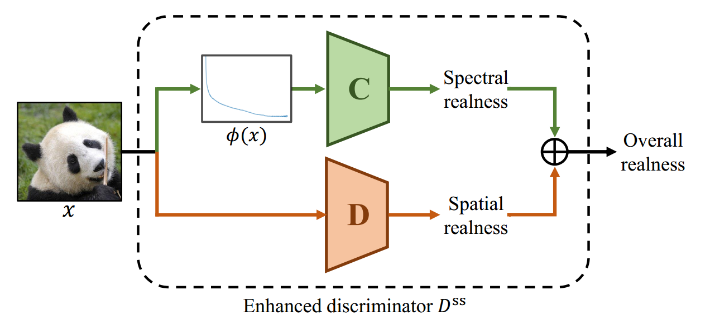
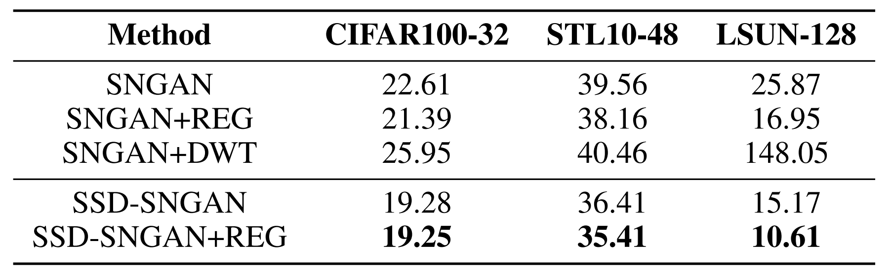
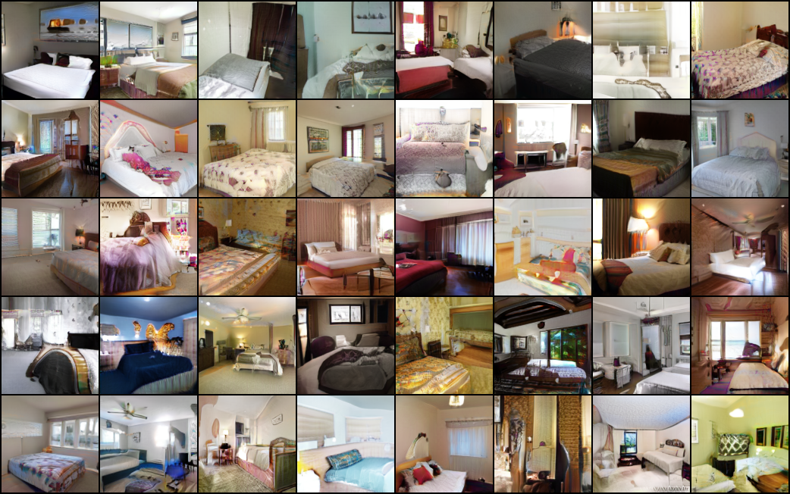

# SSD-GAN

Pytorch implementation of our paper: ["SSD-GAN: Measuring the Realness in the Spatial and Spectral Domains"](https://arxiv.org/abs/2012.05535).

<p align="center">

</p>

### Dependencies

```
pip install torch-mimicry
```

### Training

- Training SSD-SNGAN on CIFAR100
```
python train_cifar100.py
```

- Training SSD-SNGAN on STL10
```
python train_stl10.py
```

- Training SSD-SNGAN on LSUN-Bedroom
```
python train_lsun.py
```

- Tensorboard visualizations
```
tensorboard --logdir=./log/YOUR_LOGDIR
```

### Testing

```
python test.py --dataset cifar100 --log_dir ./log/cifar100
```

### Results

FID scores.
<p align="center">

</p>

Generations of SSD-SNGAN trained on LSUN-bedroom at 128×128.
<p align="center">

</p>

### Bibtex
If this work is useful for your research, please consider citing :
```
@inproceedings{chen2020ssd,
  title={SSD-GAN: Measuring the Realness in the Spatial and Spectral Domains},
  author={Chen, Yuanqi and Li, Ge and Jin, Cece and Liu, Shan and Li, Thomas},
  booktitle={AAAI},
  year={2021}
}
```

### Acknowledgement
The code used in this research is based on [mimicry](https://github.com/kwotsin/mimicry).

### Contact
Feel free to contact me if there is any questions (cyq373@pku.edu.cn).
